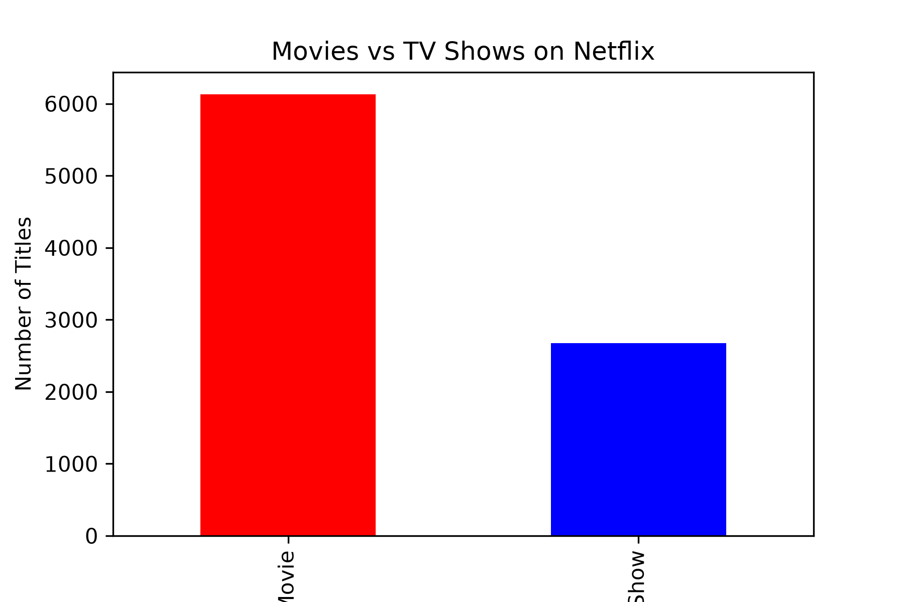

# 🎬 Netflix Exploratory Data Analysis (EDA)

## 📌 Project Overview
This project performs Exploratory Data Analysis (EDA) on the Netflix Titles dataset using Python. It aims to uncover trends in content type, genres, countries, release years, ratings, and other key attributes through data cleaning, analysis, and visualizations. The project was built as part of the CodeAlpha Data Analytics Internship to strengthen practical data analysis and visualization skills.

## 📁 Project Structure
- `dataset/`: Contains raw data files.
- `images/`: Saved visualization outputs.
- `notebook/`: Core analysis in Python notebooks.

## 📊 Key Findings
- **Point 1:** Most content on Netflix consists of movies.
- **Point 2:** Major growth occurred post-2015.

## 🖼️ Visualizations

## 🛠️ How to Run
1. Install requirements: `pip install pandas matplotlib seaborn`
2. Open `notebook/Netflix_EDA.ipynb` in VS Code or Jupyter.
